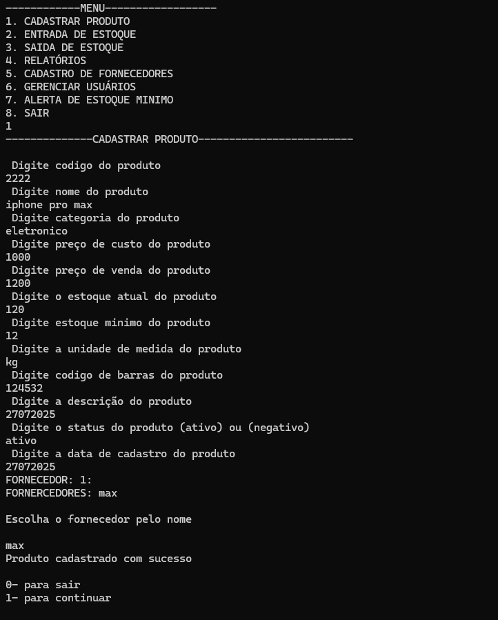

# 📦 Sistema de Controle de Estoque (C)

Este projeto é um **sistema de gerenciamento de estoque** desenvolvido em linguagem C, com funcionalidades voltadas para controle de produtos, fornecedores e movimentação de estoque. O sistema oferece recursos completos, incluindo relatórios e alertas de estoque mínimo, simulando uma aplicação utilizada no comércio ou empresas.

---

## ✅ Funcionalidades

- **Cadastro de produtos** (nome, código, preço, quantidade, estoque mínimo)
- **Entrada de estoque** (adição de novos itens ou reposição)
- **Saída de estoque** (venda ou baixa de produtos)
- **Relatórios**:
  - Lista de produtos cadastrados
  - Estoque atual
  - Produtos abaixo do estoque mínimo
- **Cadastro e gerenciamento de fornecedores**
- **Gerenciamento de usuários**
- **Alerta automático para estoque mínimo**

---

## 🛠️ Tecnologias e Conceitos Utilizados

- Linguagem **C**
- Estruturas condicionais (`if`, `else`) e loops (`for`, `while`)
- Arrays e manipulação de registros
- Modularização com **funções**
- Simulação de sistema empresarial
- Organização em menus interativos

---

## 📷 Demonstração



*(Adicione um print do programa rodando para deixar mais profissional)*

---

## ▶️ Como executar

1. Clone o repositório:
   ```bash
   git clone https://github.com/felipesilvalima/sistema-estoque-c.git
2. Acesse a pasta:
   cd sistema-estoque-c
   
3. Compile e execute:
   gcc estoque.c -o estoque/
./estoque

👨‍💻 Autor Felipe Silva Lima
📧 felipesilvalima200@gmail.com
🔗 www.linkedin.com/in/ felipesilvalima2030
